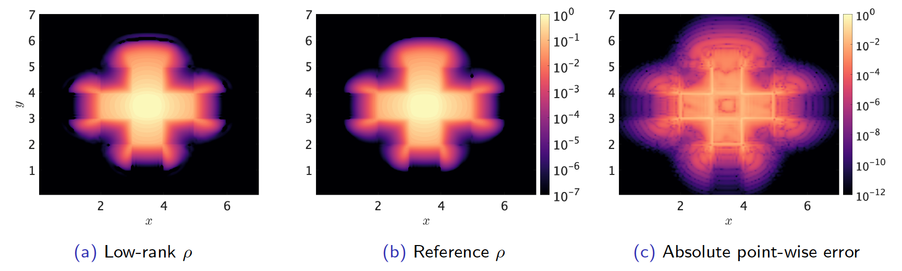
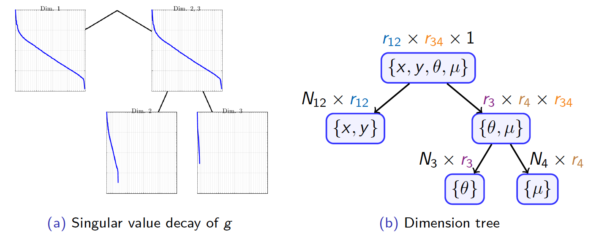
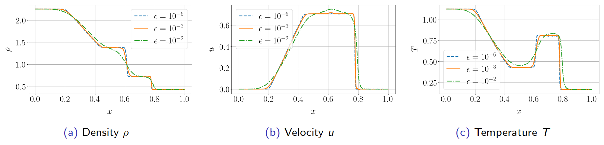
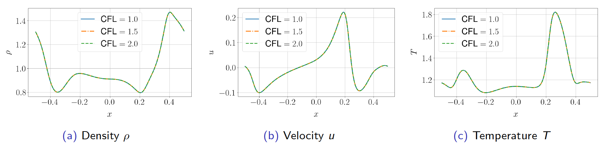

# Low-rank tensor methods

Another major component of my research focuses on low-rank tensor methods and their applications to problems in kinetic theory. Kinetic models offer a mesoscale description of a system, where molecular dynamics is impractical and continuum models such as the Euler and Navier-Stokes equations breakdown. These models pose significant challenges for existing simulation tools due to their high dimensionality (often 6D plust time) and multi-scale features which create tremendous numerical stiffness.

A fairly recent approach to address high-dimensional problems is based on low-rank approximation techniques. The basic idea is that the solution on the mesh is represented in a separable SVD-like form. For example, the rank $r$ approximation of a function $f(x,y,t)$ is given by
$$
f(x,y,t) \approx \sum_{\ell=1}^{r} \sigma_{\ell}(t) \mathbf{u}_{\ell}(x,t) \mathbf{v}_{\ell}^{\top}(y,t).
$$
Such an approximation can be built from data samples taken at discrete mesh points using the SVD algorithm. The separability of the dimensions along with SVD truncation reduces the storage at each time level from $\mathcal{O}(N^{2})$ to $\mathcal{O}(Nr)$, where $r \ll N$. Other operations, such as computing integrals are also cheaper, since the operations can be performed locally on pieces of the decomposition. For example, we can perform numerical integration in $y$ using $\mathcal{O}(Nr)$ operations:
$$
\sum_{j=1}^{N} f(x_{i}, y_{j},t^{n}) \Delta y = \sum_{\ell=1}^{r} \sigma_{\ell}(t^{n}) \mathbf{u}_{\ell}(x_{i},t^{n}) \left( \sum_{j=1}^{N} \mathbf{v}_{\ell}^{\top}(y_{j},t^{n}) \right) \Delta y.
$$
The process is quite similar for high-dimensional problems, which use variants of this format to address the curse-of-dimensionality. Notable examples are the hierarchical Tucker tensor format and the tensor train format. In any case, the use of truncation is crucial for compressing the function.

__My research is aimed at constructing high-order low-rank methods with structure-preserving capabilities__. In particular, I am interested in methods with asymptotic-preserving (AP) capabilities and moment preservation. Methods with the AP properties are highly desireable for multiscale kinetic simulations because they can treat the diverse range of regimes present in these types of problems. Additionally, such methods can alleviate the more prohibitive restrictions on the time step and the spatial resolution introduced by small-scale phenomena, leading to more efficient methods. There is extensive literature on AP methods developed in the last several decades, however, many of these schemes remain impractical due to high-dimensionality. __The goal of my work is to bridge these techniques and has focused on addressing several challenges__[^1][^2]:
* development of low-rank methods with improved flexibility; arbitrary high-order accuracy, use of novel tensor formats, and coupling with AP schemes.
* treatment of problems with different asymptotic limits, e.g., diffusive and fluid limits
* new techniques to preserve moments such as mass, momentum, and energy.

# Highlights

## Lattice test

The lattice test is used as a proxy application for modeling nuclear reactors. It is regarded as a challenging test problem because the material data is discontinuous and involves abrupt transitions between free-streaming and opaque regions of the domain. A source is placed in the middle of the domain which emits particles that scatter and absorb with the materials surrounding it. Below we plot the density $\rho$ obtained with the high-order low-rank method as well as a high-order reference solution. As expected, the largest errors coicide with the locations of jump discontinuities in the material data.

<figure style="text-align: center;">
    
    <figcaption> </figcaption>
</figure>

We also investigated the low-rank structures in the high-dimensional function $g$ in the formulation by examining the relative decay rate of its singular values. Below, we show a plot of the relative singular value decay for such a function, along with its corresponding dimension tree to show how dimensions are grouped.
<figure style="text-align: center;">
    
    <figcaption> </figcaption>
</figure>
The singular values in the above plot are shown on a logarithmic scale, with y-axis covering four-orders of magnitude. We observe a reasonable decay in the nodes towards the root of the tree, followed by rapid decay at the leaf nodes. For this problem, this compression results in an overall reduction of the degrees of freedom by nearly 95%. By further exploring tensor product structure in space, we can achieve further reductions to as much as 99%.  

## High-order is beneficial in the low-rank setting

The accuracy of low-rank methods turns out to be quite sensitive to the choice of discretization, so one must take great care when designing these methods. The figure below shows cross-sections of the density obtained with two different low-rank methods. We considered a high-order discreteization (third-order IMEX and fifth-order WENO) as well as a low-order discretization (first-order IMEX and MUSCL). The latter discretization is a fair representative of what is used in the dynamical low-rank community, due to the projector splitting intrinstic to these methods. Our result show that low-order methods notably underpredict the density due to excessive numerical diffusion. In contrast, the high-order low-rank scheme yields a more faithful approximation of the function.

## Riemann problem

The Sod shock tube problem is a well known benchmark for testing the accuracy of fluid solvers. We simulated this problem kinetically using a low-rank method, which conserves mass, momentum, and energy to machine precision. The proposed method is also AP in the sense that it recovers the Euler limit when the Knudsen number $\epsilon \rightarrow 0$. This test allows us to check the ability of the method to capture rarefaction waves as well as shocks and other discontinuous structures. The plot below shows the macroscopic variables in the simulation at different values of $\epsilon$. In particular, we see that the solution structures recover those of the Euler limit as $\epsilon \rightarrow 0$.

<figure style="text-align: center;">
    
    <figcaption> </figcaption>
</figure>

## Mixed-regime problem

The mixed regime problem uses a spatially dependent Knudsen number $\epsilon(x)$ which varies in size from $\mathcal{O}(10^{-6})$ to $\mathcal{O}(1)$. Therefore it combines characteristics from both the kinetic and fluid limits. This is were an AP method demonstrates its effectiveness. In regions which are more fluid-like, the time scales will be extremely stiff, which necessitate small time steps. In contrast, our approach allows one to take a CFL number that is independent of $\epsilon$ and remain stable. In the figure below, we show the macroscopic variables at the final time step using different values of the CFL.

<figure style="text-align: center;">
    
    <figcaption> </figcaption>
</figure>

[^1]: **W.A. Sands**, W. Guo, J.-M. Qiu, and T. Xiong. ["High-order adaptive rank integrators for multi-scale linear kinetic transport equations in the hierarchical Tucker format."](https://arxiv.org/abs/2406.19479) *arXiv:2406.19479* 
[^2]: N.Zheng, **W.A. Sands**, D.Hayes, and J.-M. Qiu. "A Local Macroscopic Conservative (LoMaC) Semi-Lagrangian Adaptive-Rank (SLAR) Method for the Multi-Scale BGK Equation" (in-progress).

