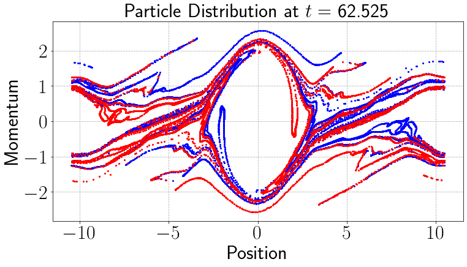
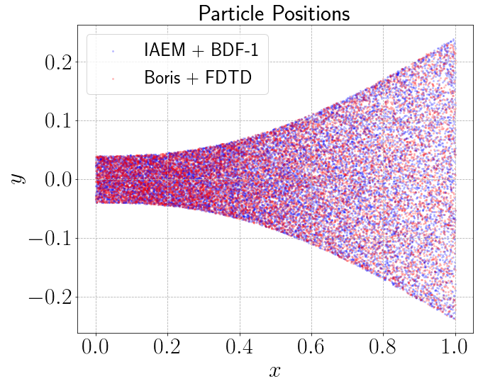
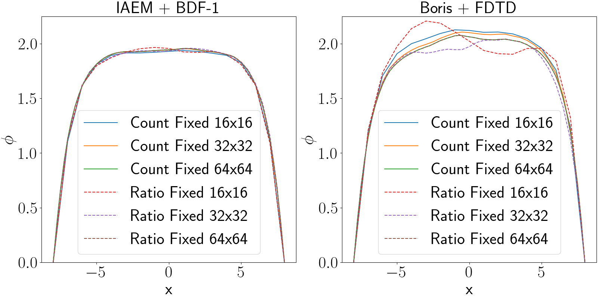
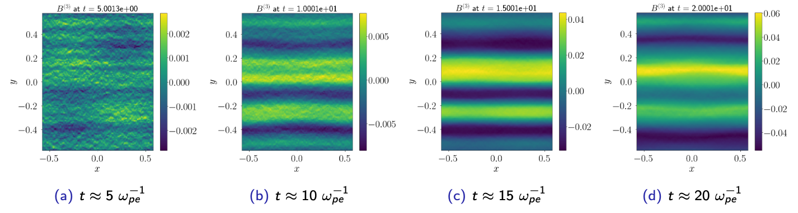

<!--  -->

# Particle methods for plasmas

I am interested in developing new particle methods with improved stability and structure-preserving capabilities. The particle-in-cell (PIC) method is among the most widely adopted tools used to perform kinetic simulations of plasmas. The original idea of PIC dates back to the 1950's and has been under active development in the subsequent decades. PIC methods represent the plasma as a collection of Lagrangian macroparticles which are evolved using the characteristics of the kinetic equation. The electric and magnetic fields are evolved on an Eulerian mesh, the most popular approach being the finite-difference time-domain (FDTD) method. Its popularity can be largely attributed to its simplicity and efficiency on parallel supercomputers. 

The historical reason for introducing a mesh is to avoid computing pair-wise interations of simulation particles, which naively scales as $\mathcal{O}(N_{p}^{2})$. Instead, the fields are represented using a mesh whose number of cells is far smaller than the particles, i.e., $N_{m} \ll N_{p}$. Mapping between the mesh and the particles is performed using spline interpolation, which requires $\mathcal{O}(N_{p})$ operations. Depending on the field solver, the complexity is $\mathcal{O}(N_{m} + N_{p})$ or $\mathcal{O}(N_{m}\log(N_{m}) + N_{p})$, which is much smaller than $\mathcal{O}(N_{p}^{2})$. In early simulations, the number of particles used were much smaller, e.g., $\mathcal{O}(10^{2})$. Nowadays, modern PIC simulations routinely use $\mathcal{O}(10^{9})$ particles. The essential steps of any PIC method follow the cadence below.
<figure style="text-align: center;">
    
    <figcaption>
    </figcaption>
</figure>

The most popular field solver used in PIC simulations is the explicit FDTD method which uses a staggered grid introduced by Yee in the 1960s. The special structure of this grid creates several complications:
* Time integration is explicit so the fields will be subject to a CFL condition that limits the time step. Simulations often use a highly refined Cartesian mesh to approximate curved boundaries, which creates a highly restrictive time step.
* The staggering requires central differencing which is difficult to extend beyond second-order accuracy for time and space.
* The discretization is known to be purely dispersive, which can create numerical artifacts in relativistic problems. Additionally, it makes the results sensitive to the number of simulation particles.

In contrast, our approach casts the field equations under the Lorenz gauge, in which Maxwell's equations become second-order wave equations. Our work in this area[^1][^2][^3] has led to several improvements over the conventional FDTD:
* The new methods are unconditionally stable (no longer subject to a CFL condition) and are robust in the presence of small mesh cells.
* Our approach permits an ease of extension to high-order in both time and space.
* The methods are provide built-in diffusion, which reduces the noise associated with PIC simulations. We have not found it necessary to introduce filtering strategies.
* We provide techniques to enforce the gauge condition, without resorting to a staggered mesh, which greatly simplifies the treatment of problems with geometry.

# Some applications of the methods

## Two-Stream Instability

<figure style="text-align: center;">
    
    <figcaption> 
    </figcaption>
</figure>

The two stream instability models a pair of counter-streaming beams of electrons in a 1D-1P periodic domain. The particles in blue move to the right while those in red move to the left. Initially, the particles are uniformly placed in the domain and provided a slight velocity perturbation the generates an instability that attempts to restore charge neutrality in the plasma. As the electric field grows, the slower electrons become trapped in the potential well, but the faster electrons escape. This leads fine scale filamentation structures in phase space that are extremely challenging to capture without the use of a particle method.

---

## Electron Beams

<figure style="text-align: center;">
    
    <figcaption>
    </figcaption>
</figure>
  
Here we considered an electron beam in a box subject to perfectly electrically conducting (PEC) walls along the boundary. Electrons are injected along the left wall of the domain and expand due to self-repulsions as they move through the box. Once the electrons reach the boundary of the domain, they are neutralized by an image charge due to the PEC boundary condition. The image above plots the electrons in the beams after many particle crossings using the new approach (IAEM + BDF-1) and the conventional PIC approach (Boris + FDTD). The two methods show excellent agreement in the prediction of the beam width and excellent long-time stability.  

---

## Plasma Sheaths

<figure style="text-align: center;">
    
    <figcaption> 
    </figcaption>
</figure>

Another application that we considered is the formation of plasma sheaths in domains with perfectly electrically conducting (PEC) boundary conditions. A system of ions and electrons are placed uniformly in domain. The ions remain stationary, while the lighter electrons are given random momenta assocatied with a Maxwellian. A potential well forms as the electrons move away from the heavier ions. A charge imbalance simultaneously grows as the electrons are neutralized along the walls of the domain. As shown in the above figure, the scalar potential $\phi$ eventually settles into a steady-state. We observed excellent agreement with theoretical predictions about the location and thickness of the sheath. As the above plot demonstrates, we achieve a notable reduction in the oscillations of the potential and a reduction in the time to achieve steady state.

---

## Relativistic Weibel Instability

<figure style="text-align: center;">
    
    <figcaption></figcaption>
</figure>

The Weibel instability is a fundamental process in high-energy-density plasmas, common in astrophysics and fusion, arising from an anisotropic distribution of momenta. Over time, the strong currents form filament-like structures resulting in highly turbulent magnetic fields that drive self-organization, as shown above. In this process, the plasma kinetic energy is converted to potential energy via the magnetic fields. This process leads to the formation of magnetic islands in which other plasma phenomena like magnetic reconnection can occur, releasing stored energy back into the plasma. 

[^1]: A.J. Christlieb, **W.A. Sands**, and S.R. White. ["A particle-in-cell method for plasmas with a generalized momentum formulation: part I, model formulation."](https://arxiv.org/abs/2208.11291) *arXiv:2208.11291*
[^2]: A.J. Christlieb, **W.A. Sands**, and S.R. White. ["A particle-in-cell method for plasmas with a generalized momentum formulation: part II, enforcing the Lorenz gauge condition."](https://link.springer.com/article/10.1007/s10915-024-02728-6) *Journal of Scientific Computing*, 101(73) (2024)
[^3]: A.J. Christlieb, **W.A. Sands**, and S.R. White. ["A particle-in-cell method for plasmas with a generalized momentum formulation: part III, a family of gauge-conserving methods."](https://arxiv.org/abs/2410.18414) *arXiv:2410.18414*

