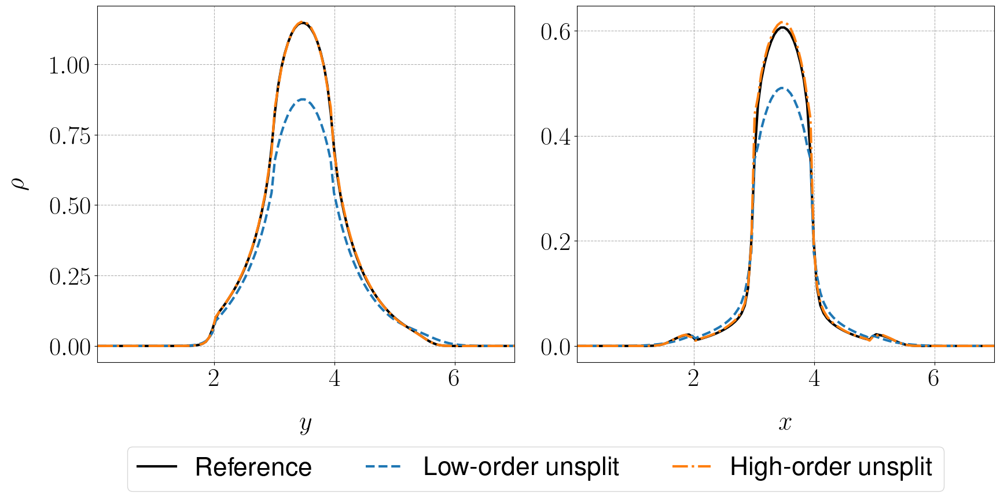

<!-- ---
layout: archive
title: ""
permalink: /research/
author_profile: true
--- -->

## Particle-in-cell (PIC) Methods for the Relativistic Vlasov-Maxwell System

In a series of recent papers, my collaborators and I have developed novel PIC methods based on an unconditionally-stable field solver for wave equations. The formulation[^1] we adopt casts Maxwell's equations under the Lorenz gauge, which leads to the system
$$
    \frac{1}{c^2} \partial_{tt} \phi -\Delta \phi =  \frac{1}{\epsilon_{0}} \rho, \\ 
    \frac{1}{c^2} \partial_{tt} \mathbf{A} -\Delta \mathbf{A}= \mu_{0} \mathbf{J}, \\ 
    \frac{1}{c^2} \partial_{t} \phi + \nabla \cdot \mathbf{A} =0.
$$
The source terms $\rho$ and $\mathbf{J}$ are dictated by the equations of motion for the particles, which are written in terms of the potentials, namely
$$
    \frac{d\mathbf{x}_{i}}{dt} = \frac{c^2 \left(\mathbf{P}_{i} - q_{i}\mathbf{A}\right)}{\sqrt{c^2\left(\mathbf{P}_{i} - q_{i} \mathbf{A}\right)^2 + \left(m_{i} c^2\right)^2}}, \\
    \frac{d\mathbf{P}_{i}}{dt} = -q_{i} \nabla \phi + \frac{q_{i} c^2 \left( \nabla\mathbf{A}\right) \cdot \left(\mathbf{P}_{i} - q_{i}\mathbf{A}\right)}{\sqrt{c^2\left(\mathbf{P}_{i} - q_{i} \mathbf{A}\right)^2 + \left(m_{i} c^2\right)^2}},
$$
with $i = 1, 2, \cdots, N_{p},$ denoting a label of a macroparticle. The fields are discretized implicitly and the particles are advanced using a semi-implicit Euler method with a Taylor corrected momentum advance that notably improves the accuracy of the update. To coordinate the solves between the Eulerian fields and the Lagrangian particles, we use linear spline interpolation. Higher order interpolation can be used to reduce simulation noise. However, such techniques can not be used in problems defined on bounded domains. 

Key mathematical and structure-preservation capabilities of the methods were later established[^2], which ensure the validity of the potential formulation and prevent the appearance of nonphysical numerical solutions. A central result of this work is a theorem which states that enforcing charge conservation is equivalent to enforcing the gauge condition. We also proved that the scheme guarantees the satisfaction of Gauss' law provided that the gauge condition is preserved. Several strategies for accomplishing this were proposed and evaluated, including methods based on solving the continuity equation and correcting the potentials to naturally enforce the gauge condition.

These methodologies have been extended to high-order time discretizations of the fields using more general time discretizations, including multi-step and multi-stage integrators[^3]. Further, we found that many of these structure-preserving capabilities carry over to these high-order temporal discretizations as well.

In summary, our work offers a number of improvements to existing particle-based simulation tools including:
* elimination of small time step restrictions in problems with geometry
* reduction of nonphysical temperature growth due to "under-resolved" meshes
* resilience to simulation noise from low-order spline interpolation and simulations with small numbers of particles.
* a co-located approach (i.e., no staggered grids) that conserves charge and enforces the Lorenz gauge condition to machine-precision

### Two-Stream Instability

<figure>
    
    <figcaption> 
    </figcaption>
</figure>

The two stream instability models a pair of counter-streaming beams of electrons in a 1D-1P periodic domain. The particles in blue move to the right while those in red move to the left. Initially, the particles are uniformly placed in the domain and provided a slight velocity perturbation the generates an instability that attempts to restore charge neutrality in the plasma. As the electric field grows, the slower electrons become trapped in the potential well, but the faster electrons escape. This leads fine scale filamentation structures in phase space that are extremely challenging to capture without the use of a particle method.

---

### Electron Beams

<figure>
    
    <figcaption>
    </figcaption>
</figure>
  
Here we considered an electron beam in a box subject to perfectly electrically conducting (PEC) walls along the boundary. Electrons are injected along the left wall of the domain and expand due to self-repulsions as they move through the box. Once the electrons reach the boundary of the domain, they are neutralized by an image charge due to the PEC boundary condition. The image above plots the electrons in the beams after many particle crossings using the new approach (IAEM + BDF-1) and the conventional PIC approach (Boris + FDTD). The two methods show excellent agreement in the prediction of the beam width and excellent long-time stability.  

---

### Plasma Sheaths

<figure>
    
    <figcaption> 
    </figcaption>
</figure>

Another application that we considered is the formation of plasma sheaths in domains with perfectly electrically conducting (PEC) boundary conditions. A system of ions and electrons are placed uniformly in domain. The ions remain stationary, while the lighter electrons are given random momenta assocatied with a Maxwellian. A potential well forms as the electrons move away from the heavier ions. A charge imbalance simultaneously grows as the electrons are neutralized along the walls of the domain. As shown in the above figure, the scalar potential $\phi$ eventually settles into a steady-state. We observed excellent agreement with theoretical predictions about the location and thickness of the sheath. As the above plot demonstrates, we achieve a notable reduction in the oscillations of the potential and a reduction in the time to achieve steady state.

---

### Relativistic Weibel Instability

<figure>
    
    <figcaption></figcaption>
</figure>
<figure>
    
    <figcaption></figcaption>
</figure>

The Weibel instability is a fundamental process in high-energy-density plasmas, common in astrophysics and fusion, arising from anisotropic momentum distributions. The anisotropic momenta are associated with strong currents and form filament-like structures. These filaments create highly turbulent magnetic fields that drive self-organization. In this process, the plasma kinetic energy is converted to potential energy via the magnetic fields. This process leads to the formation of magnetic islands in which other plasma phenomena like magnetic reconnection can occur, releasing stored energy back into the plasma. 

In the top figure, we show that each of the proposed methods agree well with the prediction of the growth rate in the magnetic field during the linear phase of the instability for a 2D-2P configuration. This includes a naive approach in which no methods are used to enforce the conservation of charge and the gauge condition. In the bottom figure, we plot the gauge error in each of the methods. The new techniques are quite effective at controlling the errors.  

---

## Low-rank Tensor Methods for Kinetic Equations

Kinetic transport equations, crucial in fields from nuclear engineering to radiotherapy, pose challenges due to high dimensionality and multi-scale features. To address these, we combined a rank-adaptive step-and-truncate method with a high-order asymptotic-preserving (AP) scheme. This approach achieves high-order accuracy, reduces memory requirements, and preserves key physical properties.

Our innovation, the step-and-truncate strategy, outperforms traditional dynamical low-rank methods by achieving higher-order accuracy, crucial for reducing numerical diffusivity. For example, in a nuclear reactor model, our method achieved accurate results with less than 5% of the storage required by full-grid solvers (Figure 3).

<figure>
    
    <figcaption> </figcaption>
</figure>

<figure>
    
    <figcaption> </figcaption>
</figure>

[^1]: A.J. Christlieb, **W.A. Sands**, and S.R. White. ["A particle-in-cell method for plasmas with a generalized momentum formulation: part I, model formulation."](https://arxiv.org/abs/2208.11291) *arXiv:2208.11291*
[^2]: A.J. Christlieb, **W.A. Sands**, and S.R. White. ["A particle-in-cell method for plasmas with a generalized momentum formulation: part II, enforcing the Lorenz gauge condition."](https://link.springer.com/article/10.1007/s10915-024-02728-6) *Journal of Scientific Computing*, 101(73) (2024)
[^3]: A.J. Christlieb, **W.A. Sands**, and S.R. White. ["A particle-in-cell method for plasmas with a generalized momentum formulation: part III, a family of gauge-conserving methods."](https://arxiv.org/abs/2410.18414) *arXiv:2410.18414*